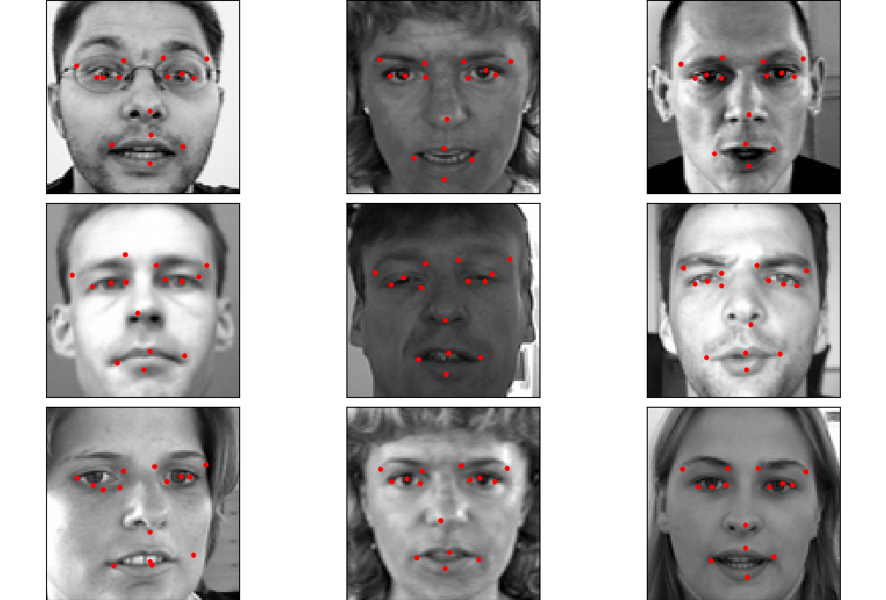

# Facial_Keypoint_Detection
Detecting and Predicting 15 different Keypoints or Landmarks on the human face using the Attention Mechanism on the ResNet Architecture and also comparing it with CNN and FCN.

